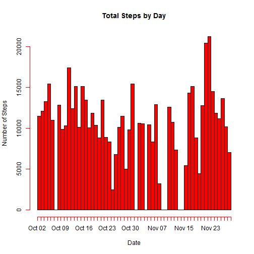

## Loading and preprocessing the data

##### This portion address the portion of loading and processing the data

```r
## Download data file if unavailable

if (!file.exists("./repdata-data-activity.zip"))
{
	setInternet2(use = TRUE)
	download.file("https://d396qusza40orc.cloudfront.net/repdata%2Fdata%2Factivity.zip", "./repdata-data-activity.zip", "auto")
}

##Unzip downloaded data file
unzip("./repdata-data-activity.zip")

##Load the data
data <- read.csv("activity.csv", colClasses = "character", header = TRUE)
```

## What is mean total number of steps taken per day?

##### This portion address the question on what is the mean total number of steps taken per day.
##### -Make a histogram of the total number of steps taken each day
##### -Calculate and report mean and median total number of steps taken per day


```r
##Split the data by date
require(dplyr)
data_split_date <- group_by(data,date)

##Sum of steps by day and remove those with count as 0
result <- summarise(data_split_date, sum(as.numeric(steps),na.rm = TRUE))
result <- subset(result, result[,2] != "0")

##Reshape data for plotting of histogram
hist_data <- NULL
for (n in 1: nrow(result))
{
	temp <- NULL
	for (i in 1: as.numeric(result[n,2]))
	{
		temp <- rbind(temp, result[n,1])
	}
	hist_data <- rbind(hist_data, temp)
}

##Plot Histogram
hist(as.Date(hist_data), col = "red", main = "Total Steps by Day", xlab = "Date", ylab = "Number of Steps", breaks =53, freq = TRUE)
```

 

```r
##Calculate mean and median
mean <- mean(result[,2])
mean
```

```
## [1] 10766.19
```

```r
median <- median(result[,2])
median
```

```
## [1] 10765
```
The mean is 1.0766189 &times; 10<sup>4</sup>. The median is 1.0765 &times; 10<sup>4</sup>.

## What is the average daily activity pattern?

##### This portion address the question on what is the average daily activity pattern.
##### -Make a time series plot (i.e. type = "l") of the 5-minute interval (x-axis) and the average number of steps taken, averaged across all days (y-axis)
##### -Which 5-minute interval on average across all the days in the dataset, contains the maximum number of steps?


```r
##This is for time series
data_split_interval <- group_by(data,interval)
result_timeseries <- summarise(data_split_interval, mean(as.numeric(steps),na.rm = TRUE))

##Order according to increasing of interval
result_timeseries <- result_timeseries[order(as.numeric(result_timeseries$interval)),]
plot(x = seq(0,1435,5), y=result_timeseries[,2], pch=17, type = "l", col = "blue", main = "Avearge Number of Steps by 5-Minute Time Intervals", ylab = "Average Number of Steps", xlab = "Minutes since 00HR of a day")
```

 

```r
##Interval with the highest average number of steps
interval <- subset(result_timeseries, result_timeseries[,2] == max(result_timeseries[,2]))[,1]
interval
```

```
## [1] "835"
```
The interval with the maximum number of steps (average across all days) is 835.

## Imputing missing values

##### This portion address the question on imputing missing values.
##### -Calculate and report the total number of missing values in the dataset (i.e. the total number of rows with NAs)
##### -Devise a strategy for filling in all the missing values in the dataset
##### -Create a new dataset that is equal to the original dataset but with the missing data filled in
##### -MAke a histogram of the total number of steps taken each day and calculate and report the mean and median total number of steps taken per day. DO these values differ from the estimates from the first part of the assignment? What is the impact of imputing missing data on the estimates of the total daily number of steps


```r
##NA Entries
na_data <- data[is.na(data$steps),]
non_na_data <- data[!is.na(data$steps),]
missing_data <- nrow(na_data)
missing_data
```

```
## [1] 2304
```

```r
##replace NA values with interval averages
for (a in 1: nrow(na_data))
{
	na_data$steps[a] <- round(subset(result_timeseries, result_timeseries[,1] == na_data$interval[a])[1,2], digits = 0)
}
new_data <- rbind(non_na_data, na_data)

new_data_split_date <- group_by(new_data,date)

##Sum of steps by day and remove those with count as 0
new_result <- summarise(new_data_split_date, sum(as.numeric(steps),na.rm = TRUE))

##Reshape data for plotting of histogram
new_hist_data <- NULL
for (n in 1: nrow(new_result))
{
	temp <- NULL
	for (i in 1: as.numeric(new_result[n,2]))
	{
		temp <- rbind(temp, new_result[n,1])
	}
	new_hist_data <- rbind(new_hist_data, temp)
}

##Plot Histogram
hist(as.Date(new_hist_data), col = "red", main = "Total Steps by Day (NA replace by interval average)", xlab = "Date", ylab = "Number of Steps", breaks =61, freq = TRUE)
```

 

```r
##Calculate mean and median
new_mean <- mean(new_result[,2])
new_mean
```

```
## [1] 10765.64
```

```r
new_median <- median(new_result[,2])
new_median
```

```
## [1] 10762
```

This total number of missing values in the dataset is 2304.
The strategy for filling in all the missing values in the dataset is to replace the missing values with the average value (round to integer) for the interval.
The mean is 1.0765639 &times; 10<sup>4</sup>. The median is 1.0762 &times; 10<sup>4</sup>.
These values are different from the values obtained without imputing missing data.
The impact of imputing missing data is not significant in relative.

## Are there differences in activity patterns between weekdays and weekends?

##### This portion address the question on whether there is differences in activity patterns between weekdays and weekends
##### -Create a new factor variable in the dataset with two levels - "weekday" and "weekend" indicating whether a given day is a weekday or a weekend day.
##### -Make a panel plot containing a time series plot (i.e. type ="l") of the 5-minute interval (x-axis) and the average number of steps taken, averaged across all weekday days or weekend days (y-acis).


```r
##Determine the day of the week for each date and add as new column in new_data dataset
new_data$day_of_week <- weekdays(as.Date(new_data$date))

##Subset data according to weekday or weekend
weekend_data <- subset(new_data, day_of_week == "Saturday"| day_of_week == "Sunday")
weekday_data <- subset(new_data, !(day_of_week == "Saturday"| day_of_week == "Sunday"))

##Create a new factor variable indicating 
weekend_data$day_of_week <- "weekend"
weekday_data$day_of_week <- "weekday"
new_factor_data <- rbind(weekend_data,weekday_data)
names_list <- names(new_factor_data)
names_list[4] <- "day_type"
names(new_factor_data) <- names_list
new_factor_data$day_type <- as.factor(new_factor_data$day_type)
unique(new_factor_data$day_type) 
```

```
## [1] weekend weekday
## Levels: weekday weekend
```

```r
##This is for time series
weekend_split_interval <- group_by(weekend_data,interval)
weekday_split_interval <- group_by(weekday_data,interval)
weekend_result <- summarise(weekend_split_interval, mean(as.numeric(steps),na.rm = TRUE))
weekday_result <- summarise(weekday_split_interval, mean(as.numeric(steps),na.rm = TRUE))


##Order according to increasing of interval
weekend_result <- weekend_result[order(as.numeric(weekend_result$interval)),]
weekday_result <- weekday_result[order(as.numeric(weekday_result$interval)),]

##plot the plots
par(mfrow = c(2,1))
plot(x = seq(0,1435,5), y=weekend_result[,2], pch=17, type = "l", col = "blue", main = "Avearge Number of Steps by 5-Minute Time Intervals (Weekend)", ylab = "Average Number of Steps", xlab = "Minutes since 00HR of a day")
plot(x = seq(0,1435,5), y=weekday_result[,2], pch=17, type = "l", col = "blue", main = "Avearge Number of Steps by 5-Minute Time Intervals (Weekday)", ylab = "Average Number of Steps", xlab = "Minutes since 00HR of a day")
```

 
